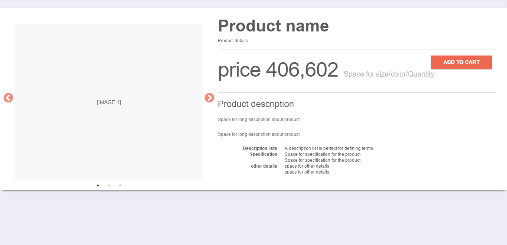
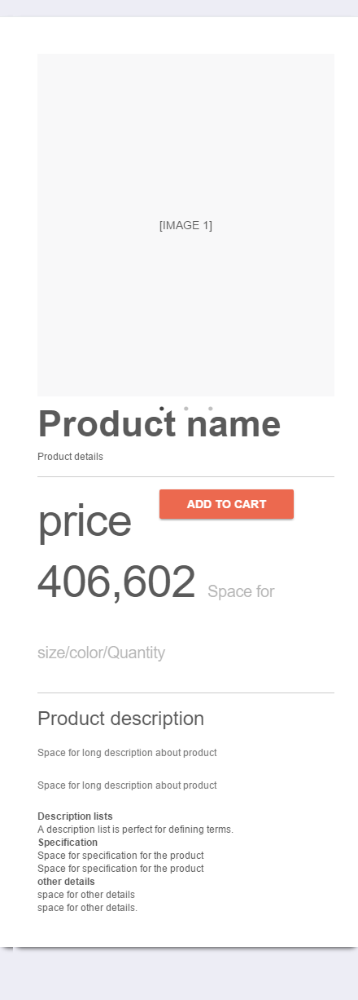
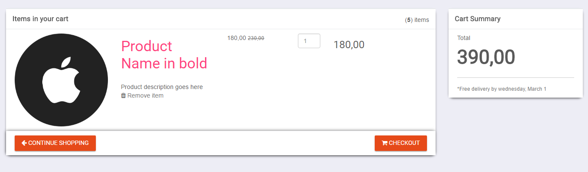

# E-commerce mobile responsive website with SEO features

The project will entail the development of a mobile responsive e-commerce website which will employ SEO (search engine optimization features). The website will cater to multiple categories of products. The website will also feature an integrated search and different client and admin panel. The website will be intuitive to user interface which will be easy to use.

#### -By Anuj Kumar Talan and Harsh Chaudhry
Harsh Chaudhry GitHub URL - <a href="https://github.com/chaudhry1994harsh/E-commerceSEO/">github.com/chaudhry1994harsh/E-commerceSEO/</a>

## Features

* The website will be developed using a host of technologies such as HTML, JSP, Servlets, etc. 
* Frontend supported with HTML5, CSS3 and JQuery.
* A database will also be used to keep track of all client details along with product details. MySQL database will be used for the same.
* The website will be made mobile responsive to target the customers on the go and SEO features will be implemented to the website.
* The user will be able to sign up and all the data about the user’s activities will be logged till the time the user’s session does not expire.
*  There will also be an admin panel for administrators who will be able to add, delete, alter products.

## Demo
### Index.html
        

### Product_detail.html

 
### cart.html

## Technologies and Frameworks used
- [Bootstrap](http://getbootstrap.com/)
- [JQuery](https://jquery.com/)
- [Material Design](https://getmdl.io/)
- [Slick carousel](http://kenwheeler.github.io/slick/)
- [Font Awesome](http://fontawesome.io/)
